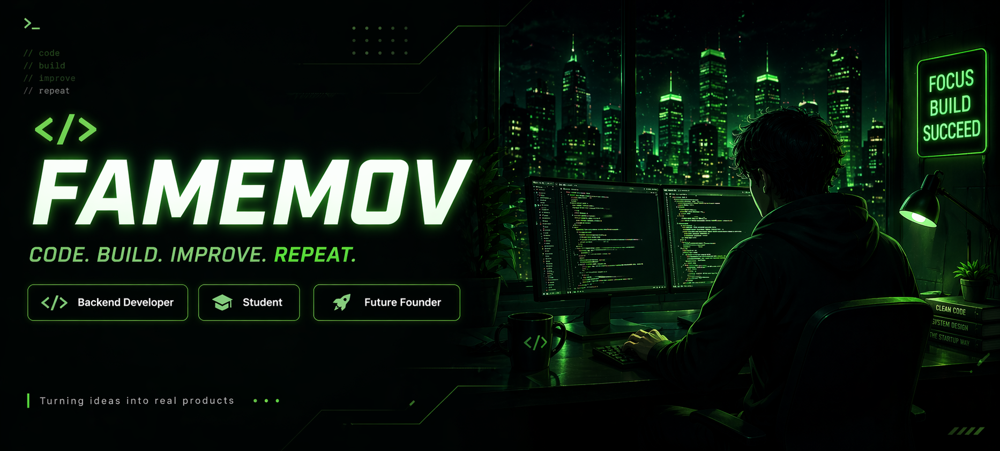

  

  

---

# 
Hey, I'm famemov 👋

---

## 🚀 About Me

- 🎓 1st-year **Software Engineering** student, 19 y.o.
- 💻 Focused on becoming a strong **backend developer**
- 🧠 Currently learning **Java** and backend fundamentals
- ⚡ Previously worked with **Python** — still my favorite for problem solving
- 🚀 Interested in **startups**, useful services, and real-world products

---

## 🛠 Tech Stack
Languages

     

Tools

     

 ---

## 📊 GitHub Stats

  

  

 
 ---

## 🔥 Contribution Streak

  

 ---

## 🐍 Contribution Snake

  

 ---

## 📌 Goals
- Build strong backend skills
- Create useful products, not just учебные проекты
- Grow from student developer to confident builder
- Turn ideas into real services

---

## 📫 Contact

   

---

## ⚡ Quote

  <i>"Consistency beats motivation."</i>

  
 

